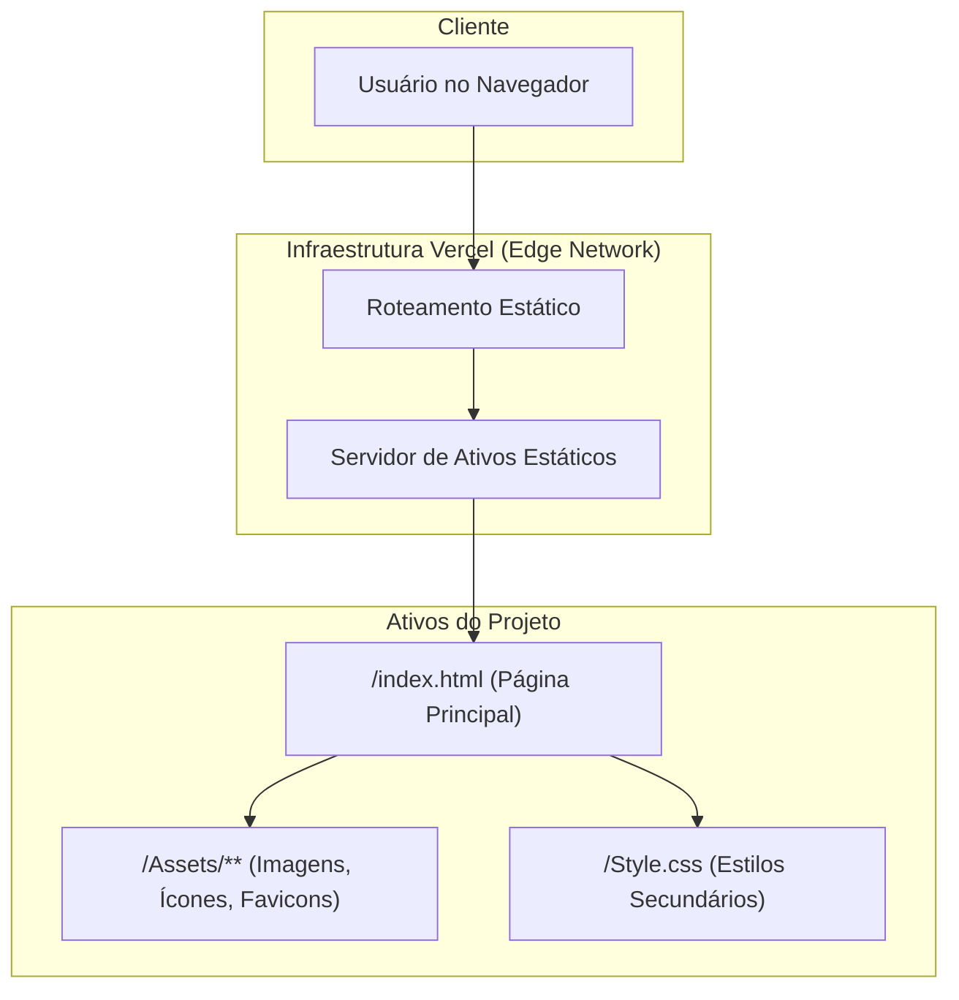

# Alfa Tech: Plataforma Educacional sobre Fundamentos da Computação

**Desmistificando a Tecnologia através de Design Moderno e Experiência Imersiva.**

<p align="center">
  <a href="https://alfa-tech-three.vercel.app/" target="_blank" rel="noopener noreferrer">
    
  </a>
</p>

---

## Abstract (Resumo Técnico)

O projeto Alfa Tech aborda a crescente necessidade de literacia digital, oferecendo uma solução para a dificuldade que iniciantes encontram ao tentar compreender conceitos fundamentais da ciência da computação. A principal lacuna identificada é a ausência de recursos que sejam simultaneamente tecnicamente precisos e pedagogicamente engajadores.

Como solução, este projeto materializa-se como uma aplicação web estática de página única (Single-Page Application) que emprega uma abordagem narrativa e visual para desmistificar a tecnologia. A metodologia central baseia-se em uma arquitetura puramente frontend, utilizando HTML5 para a estrutura semântica e CSS3 avançado para a apresentação.

A inovação do projeto não reside na criação de uma nova tecnologia, mas na aplicação de princípios de design moderno — tipografia fluida (`clamp()`), hierarquia visual consistente e layout minimalista — a um domínio educacional. O resultado é um website acessível, limpo e informativo, que serve como um ponto de entrada convidativo ao mundo da tecnologia, transformando um tópico potencialmente intimidador em uma experiência de aprendizado atraente e eficaz.

## Badges Abrangentes


## Sumário (Table of Contents)

1. [Introdução e Motivação](#introdução-e-motivação)
2. [🎬 Demonstração Visual](#-demonstração-visual)
3. [Arquitetura do Sistema](#arquitetura-do-sistema)
4. [Decisões de Design Chave](#decisões-de-design-chave)
5. [✨ Funcionalidades Detalhadas (com Casos de Uso)](#-funcionalidades-detalhadas-com-casos-de-uso)
6. [🛠️ Tech Stack Detalhado](#️-tech-stack-detalhado)
7. [📂 Estrutura Detalhada do Código-Fonte](#-estrutura-detalhada-do-código-fonte)
8. [📋 Pré-requisitos Avançados](#-pré-requisitos-avançados)
9. [🚀 Guia de Instalação e Configuração](#-guia-de-instalação-e-configuração)
10. [⚙️ Uso Avançado e Exemplos](#️-uso-avançado-e-exemplos)
11. [🧪 Estratégia de Testes e Qualidade de Código](#-estratégia-de-testes-e-qualidade-de-código)
12. [🚢 Deployment Detalhado e Escalabilidade](#-deployment-detalhado-e-escalabilidade)
13. [❓ FAQ (Perguntas Frequentes)](#-faq-perguntas-frequentes)
14. [📜 Licença e Aspectos Legais](#-licença-e-aspectos-legais)
15. [📞 Contato](#-contato)

## Introdução e Motivação

Em uma era dominada pela tecnologia, a compreensão de seus fundamentos tornou-se uma forma essencial de alfabetização. No entanto, para muitos iniciantes, o mundo dos computadores permanece uma "caixa-preta" intimidadora, repleta de jargões e conceitos abstratos. Recursos educacionais existentes frequentemente caem em dois extremos: ou são excessivamente simplificados, omitindo detalhes cruciais, ou são densamente técnicos, tornando-se inacessíveis para o público leigo.

O projeto **Alfa Tech** nasce da motivação de preencher essa lacuna. A proposta de valor única do projeto é a fusão de um conteúdo pedagógico sólido com uma experiência de usuário (UX) moderna e imersiva. Ao invés de simplesmente apresentar fatos, utilizamos analogias relacionáveis, uma estrutura narrativa lógica e um design visualmente estimulante para construir o conhecimento de forma intuitiva.

O objetivo de longo prazo é não apenas educar, mas também inspirar curiosidade, fornecendo a confiança e a base conceitual necessárias para explorar tópicos mais avançados, seja por interesse pessoal ou como um ponto de partida para uma carreira na área de tecnologia.

## 🎬 Demonstração Visual

<p align="center">
  
</p>

## Arquitetura do Sistema

A arquitetura do Alfa Tech é fundamentada no modelo de **Arquitetura Frontend Monolítica**, deliberadamente simplificada para focar na entrega de conteúdo estático de alta qualidade. Por ser uma aplicação client-side, todos os componentes residem e são executados no navegador do usuário, sem dependência de um servidor backend.



**Explicação do Fluxo:**

1. **Usuário** acessa a aplicação através do navegador
2. **Edge Network da Vercel** intercepta e roteia a requisição
3. **Servidor de Ativos Estáticos** entrega o `index.html` principal
4. Navegador renderiza a página e carrega recursos do diretório `/Assets`
5. Interface educacional interativa é apresentada ao usuário

## Decisões de Design Chave

1. **Stack "Vanilla" (HTML/CSS Puros):** Decisão estratégica de não utilizar frameworks JavaScript para manter o código enxuto, desempenho otimizado e foco total na qualidade da apresentação educacional.

2. **CSS Modular e Minimalista:** Estilos centralizados em `Style.css`, reduzindo complexidade e facilitando manutenção.

3. **Design Limpo e Moderno:** Tipografia fluida com `clamp()` e uso moderado de sombras e gradientes para foco na leitura.

4. **Semântica e Responsividade:** Estrutura com tags semânticas (`<section>`, `<header>`, `<footer>`) para acessibilidade e SEO, com design "mobile-first" através de media queries bem definidas.

5. **Abordagem Pedagógica Visual:** Integração de ícones representativos e analogias visuais para reforçar conceitos abstratos de computação.

## ✨ Funcionalidades Detalhadas (com Casos de Uso)

### 1. Hero Section Imersiva

**Propósito:** Introdução visualmente impactante com título claro e subtítulo objetivo que estabelece o tom moderno e profissional da plataforma.

**Caso de Uso:** Novo visitante acessa o site e é imediatamente cativado por cabeçalho dinâmico, incentivando-o a explorar o conteúdo educacional completo.

### 2. Cards Minimalistas

**Propósito:** Conteúdo segmentado em seções lógicas contidas em "cards" com bordas suaves e contraste sutil para facilitar a leitura.

**Caso de Uso:** Estudante querendo entender diferença entre hardware e software pode focar diretamente no card correspondente, isolando visualmente a informação para melhor concentração.

### 3. Aprendizagem Reforçada por Ícones

**Propósito:** Conceitos-chave como CPU, RAM e Armazenamento acompanhados por ícones e imagens representativas para reforço visual.

**Caso de Uso:** Ao ler sobre "CPU, o cérebro do computador", usuário vê imagem de processador ao lado do texto, criando associação visual que reforça memorização.

### 4. Design Responsivo Educacional

**Propósito:** Layout que se adapta fluidamente a diferentes dispositivos, mantendo qualidade educacional em smartphones, tablets e desktops.

**Caso de Uso:** Estudante pode acessar conteúdo durante deslocamento no smartphone com mesma qualidade de experiência que teria em desktop.

## 🛠️ Tech Stack Detalhado

| Categoria              | Tecnologia         | Versão | Propósito no Projeto                                   | Justificativa da Escolha                                                        |
| :--------------------- | :----------------- | :----- | :----------------------------------------------------- | :------------------------------------------------------------------------------ |
| **Frontend**           | **HTML5**          | N/A    | Estruturação semântica do conteúdo educacional         | Padrão universal para web, essencial para acessibilidade e SEO                  |
| **Estilização**        | **CSS3**           | N/A    | Design minimalista, tipografia fluida e responsividade | Poder nativo para criar interfaces educacionais modernas sem dependências       |
| **Deployment**         | **Vercel**         | N/A    | Hospedagem, CI/CD e distribuição global via CDN        | Integração perfeita com GitHub, deployments automáticos e performance otimizada |
| **Controle de Versão** | **Git & GitHub**   | N/A    | Gerenciamento de código-fonte e versionamento          | Padrão da indústria para desenvolvimento colaborativo e controle de mudanças    |
| **Assets**             | **Imagens/Ícones** | N/A    | Recursos visuais para reforço educacional              | Suporte visual essencial para compreensão de conceitos abstratos                |

## 📂 Estrutura Detalhada do Código-Fonte

```
Alfa-Tech-main/
├── .github/                # Workflows, templates e governança
├── Assets/                 # Recursos visuais e de mídia educacional
│   ├── Image/              # Imagens ilustrativas (CPU, RAM, Storage)
│   ├── favicon/            # Conjunto completo de favicons multiplataforma
│   └── media/              # Mídia geral (logo, ícones sociais)
├── docs/                   # Documentação complementar
├── tests/                  # Testes de smoke
├── CHANGELOG.md            # Registro de mudanças
├── CODE_OF_CONDUCT.md      # Código de conduta
├── CONTRIBUTING.md         # Guia de contribuição
├── LICENSE                 # Arquivo de licença MIT
├── README.md               # Este arquivo de documentação
├── SECURITY.md             # Política de segurança
├── Style.css               # Folha de estilo principal
├── index.html              # Ponto de entrada principal
└── package.json            # Scripts de lint/format e testes
```

**Detalhamento dos Arquivos:**

- `index.html`: Arquivo principal contendo estrutura HTML semântica e conteúdo educacional
- `Assets/Image/`: Imagens educacionais de alta qualidade para conceitos de hardware e software
- `Assets/favicon/`: Conjunto completo de favicons para diferentes dispositivos e plataformas
- `Style.css`: Estilos minimalistas e consistentes
- `.github/`: CI, CodeQL, templates e dependabot
- `tests/`: Teste de smoke simples para validar presença de seções críticas

## 📋 Pré-requisitos Avançados

**Para Usuários:**

- **Navegador Web Moderno:** Chrome, Firefox, Safari, Edge (suporte a HTML5 e CSS3)

**Para Desenvolvimento (opcional):**

- **Git:** Sistema de controle de versão para clonar repositório
- **Editor de Código:** VS Code, Sublime Text ou IDE similar
- **Node.js 18+ (opcional):** Para rodar lint/format/testes locais
- **Servidor Local (Opcional):** Para desenvolvimento com Live Reload

Nenhuma dependência de runtime ou processo de compilação é necessário para executar o projeto.

## 🚀 Guia de Instalação e Configuração

A plataforma educacional foi projetada para execução direta sem dependências ou compilação.

1. **Clonar o Repositório:**

```bash
git clone https://github.com/ESousa97/Alfa-Tech.git
cd Alfa-Tech-main
```

2. **Execução Local Simples:**

```bash
# macOS
open index.html

# Linux
xdg-open index.html

# Windows
start index.html
```

3. **Servidor Local (Recomendado):**
   Para melhor experiência de desenvolvimento:
4. **Lint e Testes (Opcional):**

```bash
npm install
npm run lint
npm test
```

```bash
# Com Python
python -m http.server 8000

# Com Node.js
npx serve .

# Com VS Code Live Server
# Clique com botão direito em index.html
# Selecione "Open with Live Server"
```

## ⚙️ Uso Avançado e Exemplos

**Experiência Educacional Completa:**

Explore o conteúdo de forma interativa:

```css
/* Personalizar cores educacionais */
:root {
  --primary-color: #5865f2;
  --glass-background: rgba(255, 255, 255, 0.1);
  --text-primary: #2c3e50;
}

/* Modificar animações de cards */
.card:hover {
  transform: translateY(-10px) scale(1.02);
  box-shadow: 0 20px 40px rgba(88, 101, 242, 0.3);
}
```

**Customização de Conteúdo:**

Adicione novas seções educacionais seguindo a estrutura:

```html
<section class="concept-card">
  <div class="icon-container">
    
  </div>
  <h3>Título do Conceito</h3>
  <p>Explicação clara e acessível do conceito...</p>
</section>
```

## 🧪 Estratégia de Testes e Qualidade de Código

**Qualidade Atual:**

- Validação manual cross-browser para experiência educacional consistente
- Testes de responsividade em múltiplos dispositivos
- Teste de smoke automatizado para presença de seções essenciais
- Lint e format via scripts de CI

**Estratégia de Qualidade Proposta:**

**Testes Educacionais:**

- **Lighthouse:** Auditoria de performance, acessibilidade e SEO educacional
- **WAVE:** Análise de acessibilidade para conteúdo educacional inclusivo

**Validação de Conteúdo:**

- **W3C Validator:** Verificação de HTML/CSS seguindo padrões web
- **Teste de Usabilidade:** Validação da clareza do conteúdo educacional

## 🚢 Deployment Detalhado e Escalabilidade

**Plataforma:** Implantado na **Vercel** com otimização para conteúdo educacional estático.

**Processo de CI/CD:**

- GitHub Actions para lint, format e testes de smoke
- CodeQL para análises de segurança
- Deploy automatizado via integração GitHub (Vercel)

**Escalabilidade Educacional:**

- **Distribuição Global:** CDN da Vercel garante acesso rápido mundialmente
- **Cache Inteligente:** Recursos educacionais cacheados em edge locations
- **Performance Otimizada:** Carregamento rápido essencial para retenção educacional

## ❓ FAQ (Perguntas Frequentes)

**P: Por que não utilizar um framework como React ou Vue?**
**R:** Para conteúdo educacional estático, frameworks adicionariam complexidade desnecessária, impactando tempo de carregamento sem oferecer benefícios significativos.

**P: Posso usar o design e conteúdo em meu projeto educacional?**
**R:** Sim. Licença MIT permite reutilização livre do código e conteúdo, mantendo apenas o aviso de licença original.

**P: Como posso contribuir com novos conceitos educacionais?**
**R:** Abra uma Issue no GitHub com sua sugestão ou envie Pull Request seguindo o padrão de estrutura existente.

**P: O conteúdo é adequado para que faixa etária?**
**R:** O conteúdo foi desenvolvido para iniciantes de qualquer idade, com linguagem acessível mas tecnicamente precisa.

**P: Como reportar erros ou sugerir melhorias?**
**R:** Use o sistema de Issues do GitHub para reportar bugs ou sugerir melhorias no conteúdo educacional.

## 📜 Licença e Aspectos Legais

Este projeto é distribuído sob a **Licença MIT**, uma licença permissiva que permite reutilização, modificação e distribuição do código (inclusive para fins educacionais e comerciais), desde que o aviso de copyright original seja mantido.

Para detalhes completos, consulte o arquivo [LICENSE](https://github.com/ESousa97/Alfa-Tech/blob/main/LICENSE).

## 📞 Contato

- **GitHub:** [@ESousa97](https://github.com/ESousa97)
- **LinkedIn:** [José Enoque Sousa](https://www.linkedin.com/in/enoque-sousa-bb89aa168/)
- **Portfólio:** [enoquesousa.vercel.app](https://enoquesousa.vercel.app)
- **Portfólio (dev):** [devportfolio-two-zeta.vercel.app](https://devportfolio-two-zeta.vercel.app/)
- **Demo Online:** [alfa-tech-three.vercel.app](https://alfa-tech-three.vercel.app/)
- **Issues:** Para bugs e sugestões, use [GitHub Issues](https://github.com/ESousa97/Alfa-Tech/issues)

---

<p align="center">
  
  
</p>

<p align="center">
  <em>Desenvolvido com ❤️ por José Enoque - Democratizando o conhecimento tecnológico através de design e educação</em>
</p>

> ✨ **Criado em:** 14 de nov. de 2024 às 00:08
